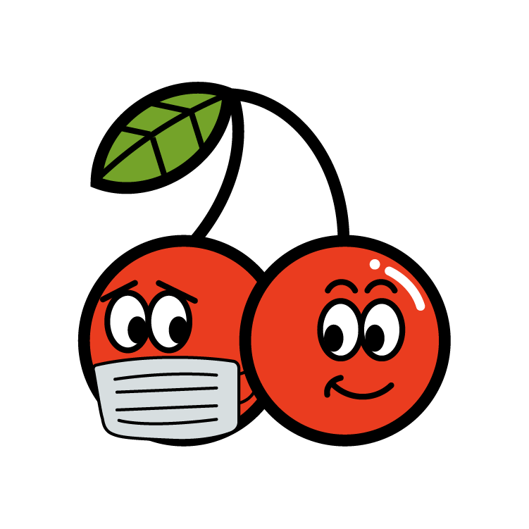
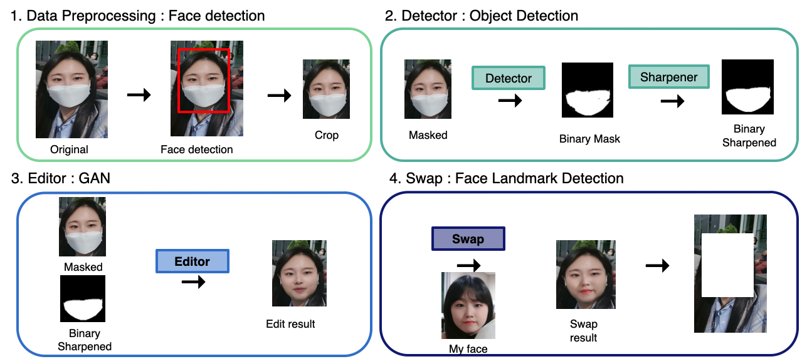
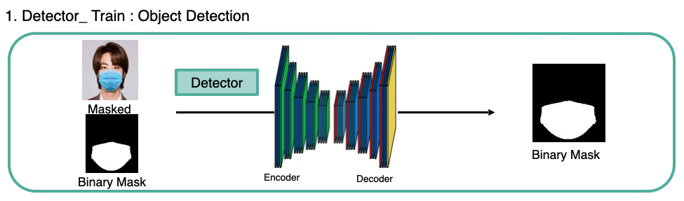
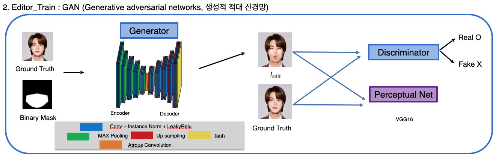
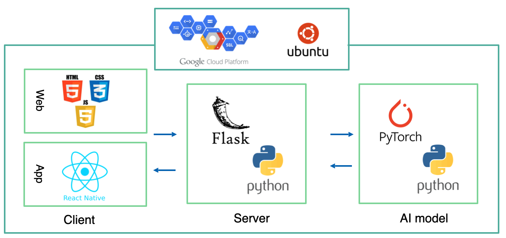
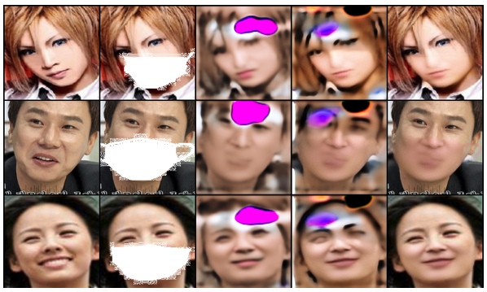
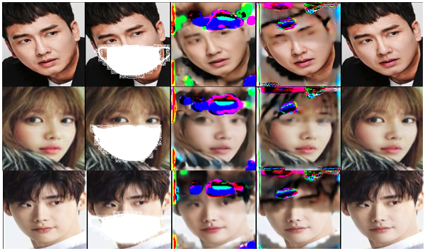

  

GAN 기반 마스크로 가려진 얼굴 이미지 생성 서비스 'Mask2Face'
============================

## ? Quick overview

#### 포스트 코로나 시대의 안전과 추억을 지키기 위한 마스크 리무버 웹/어플 서비스

> 1) 사용자의 마스크 쓴 사진의 마스크 부분 탐지 (Detect Module)
> 2) GAN을 이용해 마스크 밖 얼굴과 자연스럽게 어울리는 얼굴 이미지 생성 (Editor Module)
> 3) 사용자의 맨얼굴 사진을 받아 본인의 얼굴과 더 유사하게 이미지 생성 (Face Swap)

- 자세한 내용은 아래 최종 발표 자료를 참고해주세요

  
## ? 수상 및 발표 자료

- KAIST SW 교육센터 2021 서초 AI 칼리지 포트폴리오 프로젝트 우수상 수상 ([link](https://drive.google.com/file/d/1DAgwf9nh3Q2QzTY6EZaIoPVGEnaX11dl/view?usp=sharing))

- Demo Video ([link](https://drive.google.com/file/d/19lh7OmpyMmUEsqIwLp2RscjDyqjgnCnK/view?usp=sharing)) 

- 최종 발표 자료 ([link](https://drive.google.com/file/d/1O5R8_9GVTeDSfEUj4zTqSLshJgOFP_f2/view?usp=sharing))

  

## 프로젝트 모델 구성

  

## Train model 구조도

## Skills

## Folder structure

this repo
│ controller.py
│
└───configs
│ config.py
│ detect.yaml
│ edit.yaml
│
└───dataprepare
│ └───img_binary
│ └───img_gt
│ └───img_mask
│ mask.py
│ numalign.py
│
└───detector
│ └───detect_result_img
│ └───weights
│ └───image
│ detect_model.py
│ detect_trainer.py
│ preprocessing_detect.py
│ sharpening.py
│
└───editor
│ └───results
│ └───weights
│ edit_model.py
│ edit_trainer.py
│ preprocessing_edit.py
└───loss
│ adversarial.py
│ dice.py
│ ssim.py
│
└───matrics
│ dicecoeff.py
│ pixelacc.py
│
└───face_swap
│ └───content
│ └───imgs
│ └───models
│ └───results
│ face_detection.py
│ face_swap.py
│ main.py

## Data set

- AFD(Asian Face Dataset) + BUPT(BUPT Dataset)

- 160 * 160, 총 10,000장의 안면 데이터 사용

  

## Training Results Sample

## Results ()

| | |

|:-------------------------:|:-------------------------:|

| |  |

  

## Face Swap scripts
- test4.jpg 에 test6.jpg의 얼굴을 swap

    python main.py --src imgs/test6.jpg --dst imgs/test4.jpg --out results/output6_4.jpg --correct_color

    
## Paper References

-  [A Novel GAN-Based Network for Unmasking of Masked Face](https://ieeexplore.ieee.org/abstract/document/9019697)

  

## Code References

- GAN Generator, Discriminator from https://github.com/kaylode/facemask-removal

- Crop from https://github.com/ternaus/facemask_detection

- Mask detection from https://wjddyd66.github.io/pytorch/Pytorch-Unet/

- Face Swap from https://github.com/wuhuikai/FaceSwap.git

- Mask generator from https://github.com/prajnasb/observations

  

## Book References

- 카일라쉬 아히르와(2019), 실전! GAN 프로젝트(데이터 사이언스 시리즈 43), 위키북스

- 황선규(2019), OpenCV 4로 배우는 컴퓨터 비전과 머신 러닝, 도서출판길벗

  

## License

)

- Copyright ? [Hana Kim](https://github.com/hanakim120).
