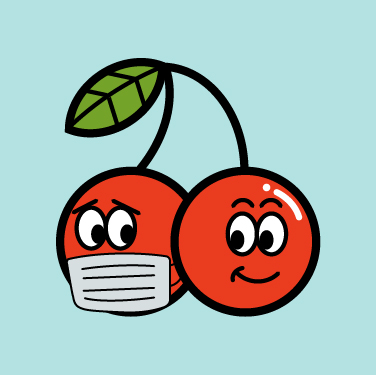
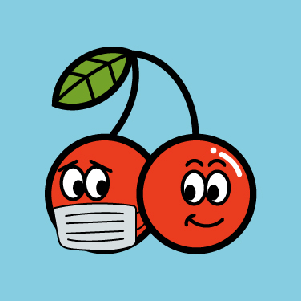
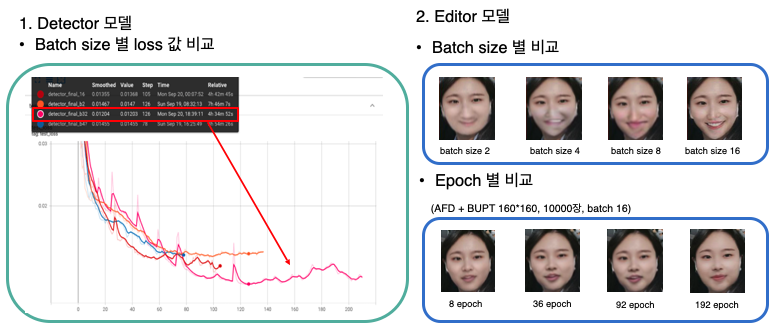
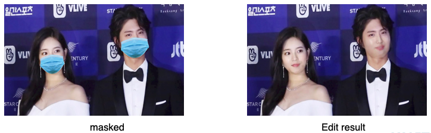
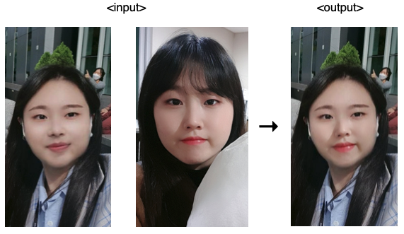

  

<p>
<a  href="https://github.com/hanakim120/GAN-based-Face-Unmasking"></a>
<p>
<h1 align="center">GAN 기반 마스크로 가려진 얼굴 이미지 생성 서비스 <strong>'Mask2Face'</strong></h1>
</p>

<p  align="center">
  




  
</p>
  
## 😷 Quick overview

### 포스트 코로나 시대의 안전과 추억을 지키기 위한 마스크 리무버 웹/어플 서비스

> 1) 사용자의 마스크 쓴 사진의 마스크 부분 탐지 (Detect Module)
> 2) GAN을 이용해 마스크 밖 얼굴과 자연스럽게 어울리는 얼굴 이미지 생성 (Editor Module)
> 3) 사용자의 맨얼굴 사진을 받아 본인의 얼굴과 더 유사하게 이미지 생성 (Face Swap)

- 자세한 내용은 아래 최종 발표 자료와 Demo Video 를 참고해주세요

  
## 🥇 수상 및 발표 자료

- KAIST SW 교육센터 2021 서초 AI 칼리지 포트폴리오 프로젝트 우수상 수상 ([link](https://drive.google.com/file/d/1DAgwf9nh3Q2QzTY6EZaIoPVGEnaX11dl/view?usp=sharing))

- Demo Video ([link](https://drive.google.com/file/d/19lh7OmpyMmUEsqIwLp2RscjDyqjgnCnK/view?usp=sharing)) 

- 최종 발표 자료 ([link](https://drive.google.com/file/d/1O5R8_9GVTeDSfEUj4zTqSLshJgOFP_f2/view?usp=sharing))

  
## 📍 프로젝트 모델 구성
<p  align="center">

</p>


## 👩🏻‍🏫 Train model 구조도

<p  align="center">

</p>

<p  align="center">

</p>

## 🛠️ Skills
<p  align="center">

</p>


## 🌳 Folder structure
```
  this repo
  │   controller.py
  │
  └───configs
  │     config.py
  │     detect.yaml
  │     edit.yaml
  │
  └───dataprepare
  │     └───img_binary
  │     └───img_gt
  │     └───img_mask
  │     mask.py
  │     numalign.py
  │
  └───detector
  │     └───detect_result_img
  │     └───weights
  │     └───image
  │     detect_model.py
  │     detect_trainer.py
  │     preprocessing_detect.py
  │     sharpening.py
  │     detect_trainer.ipynb
  │
  └───editor
  │     └───results
  │     └───weights
  │     edit_model.py
  │     edit_trainer.py
  │     preprocessing_edit.py
  │
  └───loss
  │     adversarial.py
  │     dice.py
  │     ssim.py
  │
  └───matrics
  │     dicecoeff.py
  │     pixelacc.py
  │
  └───face_swap
  │     └───content
  │     └───imgs
  │     └───models
  │     └───results
  │     face_detection.py
  │     face_swap.py
  │     main.py
  │     face_landmark_detection.ipynb
   ```


## 🗂️ Data set

- AFD(Asian Face Dataset) + BUPT(BUPT Dataset)

- 160 * 160, 총 10,000장의 안면 데이터 사용

  
## 🤖 Training Results Sample

<p  align="center">


</p>


## 💻 Face Swap scripts
- test4.jpg 에 test6.jpg의 얼굴을 swap

```
python main.py --src imgs/test6.jpg --dst imgs/test4.jpg --out results/output6_4.jpg --correct_color
```

## 📊 Detector, Editor Results

<p  align="center">

  

</p>

## 😃 Face Swap 까지 적용한 result

<p  align="center">

</p>

## 🤳🏻 Service
### www.mask2face.me 
- 본 서비스는 현재 중단되었습니다.

<p  align="center">

</p>

## 📃 Paper References

-  [A Novel GAN-Based Network for Unmasking of Masked Face](https://ieeexplore.ieee.org/abstract/document/9019697)

  

## ⌨️ Code References

- GAN Generator, Discriminator from https://github.com/kaylode/facemask-removal

- Crop from https://github.com/ternaus/facemask_detection

- Mask detection from https://wjddyd66.github.io/pytorch/Pytorch-Unet/

- Face Swap from https://github.com/wuhuikai/FaceSwap.git

- Mask generator from https://github.com/prajnasb/observations

  

## 📚 Book References

- 카일라쉬 아히르와(2019), 실전! GAN 프로젝트(데이터 사이언스 시리즈 43), 위키북스

- 황선규(2019), OpenCV 4로 배우는 컴퓨터 비전과 머신 러닝, 도서출판길벗

  

## License

[](https://tldrlegal.com/license/gnu-lesser-general-public-license-v3-(lgpl-3))

- Copyright [Hana Kim](https://github.com/hanakim120).
